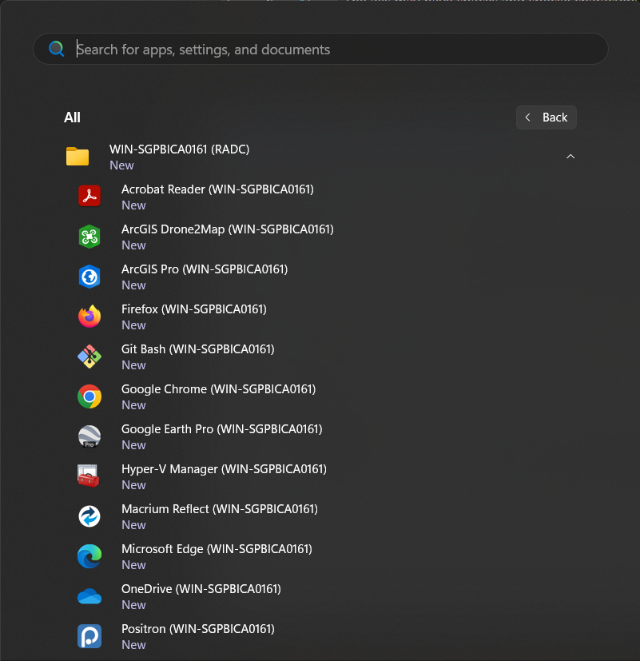
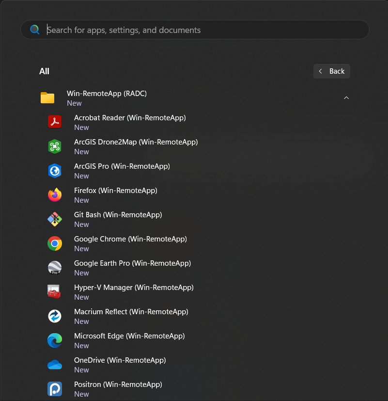
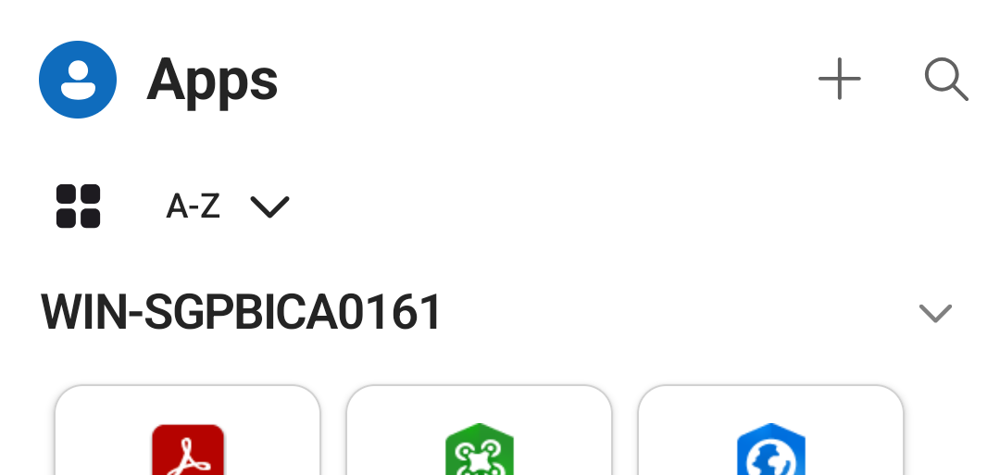

If you want to customize the name of the hosting server that appears in RAWeb or any of the remote desktop clients, or you want to customize the names of the terminal servers for your remote apps and desktops, follow the instructions after the example section.

# Example (before and after)

_Using `<add key="TerminalServerAliases" value="WIN-SGPBICA0161=Win-RemoteApp;" />`_

| Before                                               | After                                                |
| ---------------------------------------------------- | ---------------------------------------------------- |
|  |  |
|  |  |
|  |  |

# Method 1: RAWeb web interface

1. Sign in to the web interface with an account that is a memeber of the Local Administrators group.
2. On the left navigation rail, click the **Policies** button.
3. Click **Configure aliases for terminal servers**.
4. In the dialog, set the **State** to **Enabled**. Under **Options**, click **Add** to add a new alias. For **Key**, specify the name of the server. For **value**, specify the alias you want to use. Click **OK** to save the alias(es).

# Method 2: IIS Manager

1. Once RAWeb is installed, open **IIS Manager** and expand the tree in the **Connections pane** on the left side until you can see the **RAWeb** application. The default name is **RAWeb**, but it may have a different name if you performed a manual installation to a different folder. Click on the **RAWeb** application.
2. In the **Features View**, double click **Application Settings** 
3. In the **Actions pane**, click **Add** to open the **Add Application Setting** dialog. 
4. Specify the properties. For **Name**, use _TerminalServerAliases_. For **Value**, specify the aliases with the format _ServerName1=Alias 1;_. You can specify multiple aliases separated by semicolons. When you are finished, click **OK**.

# Method 3. Directly edit `appSettings.config`.

1. Open **File Explorer** and navigate to the RAWeb directory. The default installation directory is `C:\inetpub\RAWeb`.
2. Navigate to `App_Data`.
3. Open `appSettings.config` in a text editor.
4. Inside the `appSettings` element, add: `<add key="TerminalServerAliases" value="" />`
5. Edit the value attribute to specify the aliases. You can specify aliases with the format _ServerName1=Alias 1;ServerName2=Alias 2;_.
6. Save the file.
